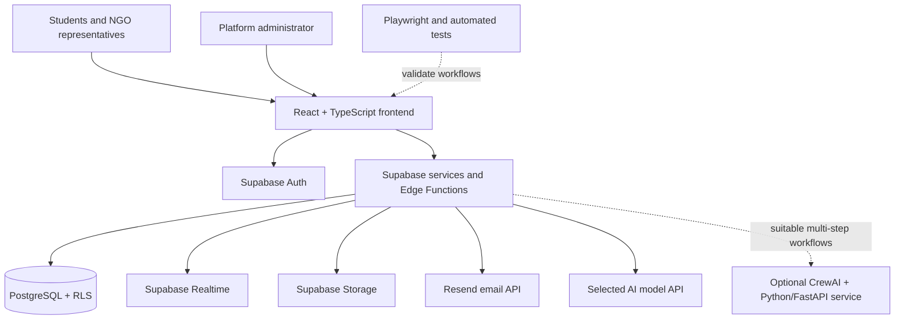

# EduSolve

### Connecting community problems with student-built technology solutions

EduSolve is a proposed AI-assisted social-impact platform that connects NGOs and eligible community organizations with student volunteers who can help develop technology-based solutions to real-world educational, digital-literacy, and community challenges.

The platform aims to help organizations find suitable student collaborators while giving students practical experience, teamwork opportunities, and a meaningful way to contribute to society.

> **Project status:** Planning / early development. Features and technologies described below are proposed and may change as the project is validated and implemented. EduSolve is not yet presented as a production-ready service.

---

## Contents

- [The problem](#the-problem)
- [Our proposed solution](#our-proposed-solution)
- [Who is EduSolve for?](#who-is-edusolve-for)
- [Planned features](#planned-features)
- [How it works](#how-it-works)
- [AI in EduSolve](#ai-in-edusolve)
- [Privacy and security](#privacy-and-security)
- [Technology stack](#technology-stack)
- [High-level architecture](#high-level-architecture)
- [Proposed repository structure](#proposed-repository-structure)
- [Development roadmap](#development-roadmap)
- [Getting started](#getting-started)
- [Contributing](#contributing)
- [Project principles](#project-principles)

## The problem

Community organizations may have practical educational or digital-literacy challenges but limited access to technical support. At the same time, students may want to apply their skills to real projects but lack a structured way to find suitable community partners and collaborate with them.

EduSolve is being designed to bridge this gap. These assumptions will need to be validated through conversations with NGOs, students, and other relevant stakeholders before claims about the scale of the problem or the platform's impact are made.

## Our proposed solution

EduSolve provides a structured place where eligible organizations can describe community problems, students can discover and apply to relevant opportunities, and approved collaborators can work together in a private project workspace.

EduSolve is intended to be a **volunteer-based social-impact platform, not a freelancing marketplace**. There will be no bidding system or salary negotiation. Project scope, workload, expected duration, deliverables, and any material or hosting expenses should be disclosed clearly before a student commits.

## Who is EduSolve for?

### 1. NGOs and community organizations

- Create an organization profile and submit relevant registration details.
- Submit community problems with clear goals, required skills, timelines, workload, and deliverables.
- Review interested students and communicate with them.
- Approve students or teams for a project.
- Review the final solution and provide feedback.

### 2. Student volunteers

- Create a profile with skills, education, experience, and portfolio links they choose to share.
- Discover and filter suitable projects.
- Express interest and discuss project expectations with an organization.
- Collaborate with approved teammates in a private workspace.
- Document contributions and learn through real-world project work.

### 3. Platform administrators

- Review organization-verification exceptions and reported activity.
- Help moderate suspicious or unsafe behaviour.
- Manage platform-level settings and resolve verification or safety issues.

Project owners remain responsible for selecting collaborators for their own projects. AI will not make the final selection decision.

## Planned features

- **Role-based accounts:** Student, organization representative, and platform administrator.
- **Organization verification workflow:** Review relevant registration details and available official records, with human review when a result is unclear.
- **Community problem submissions:** Structured project descriptions, skills, scope, workload, timelines, and deliverables.
- **Project discovery:** Browse, search, and filter opportunities.
- **Applications and approvals:** Students express interest; the organization reviews and accepts or declines applicants.
- **Real-time chat:** Project-related conversations between students and organizations.
- **AI-assisted chat:** A user can request a summary of the other party's authorized profile and the current project.
- **Two-way privacy notices:** Both sides see safety guidance before their first chat.
- **Safety controls:** Report and block options, with sensitive-information warnings where feasible.
- **Private project workspace:** Approved team members collaborate using basic tasks, deadlines, progress updates, and links or attachments.
- **Feedback and impact records:** Organizations review deliverables and document outcomes without inventing impact statistics.
- **Email and in-app notifications:** Important status changes and project events are communicated to users.

Features will be delivered incrementally; this list describes the intended product, not a claim that every feature is already available.

## How it works

1. An organization registers and provides the information required for verification.
2. EduSolve reviews available evidence; uncertain cases are referred for human review.
3. An eligible organization submits a clearly scoped community problem.
4. Students discover projects and express interest.
5. The student and organization communicate in EduSolve chat.
6. Either participant can use the AI assistant to understand information they are authorized to view.
7. The organization approves a student or team.
8. The backend creates a private project workspace for approved members.
9. The team develops and submits the solution.
10. The organization reviews the outcome and provides feedback.

## AI in EduSolve

AI is intended to assist people, not replace their judgement.

### AI-assisted chat summaries

- **Organization view:** A summary of a student's shared skills, relevant experience, portfolio, and stated availability, along with how these relate to the project.
- **Student view:** A summary of the organization's authorized profile, verification status, and project requirements.
- **Useful follow-up questions:** Suggestions to help clarify responsibilities, scope, timelines, and expectations.

The AI must distinguish known information from missing information and must not invent qualifications, guarantee that an organization is trustworthy, expose unrelated private conversations, or make final acceptance decisions.

### Future agentic workflows

CrewAI and a separate Python service are being considered for workflows that genuinely require multiple steps, such as structuring a problem statement or preparing an organization-verification report. These are candidates for later implementation, not prerequisites for the initial chat-summary feature. Any agent tools will have limited permissions, and consequential decisions will remain under human control.

## Privacy and security

Privacy and access control are core requirements for EduSolve.

- Enforce permissions in the backend and database; hiding a UI element is not sufficient.
- Send an AI model only the information the current user is authorized to access.
- Keep API keys and privileged credentials on the server, never in frontend code.
- Hash passwords through the chosen authentication provider and use secure session handling.
- Protect private chat, profile fields, uploaded files, and project workspaces with explicit access rules.
- Show both students and organization representatives a safety notice before their first chat.
- Warn about potentially sensitive information where detection is feasible, while making clear that detection cannot catch everything.
- Provide reporting and blocking workflows for unsafe behaviour.
- Validate input, restrict uploads, apply rate limits to sensitive endpoints, and record important security-relevant actions.
- Use browser and API tests to check that users cannot access another person's private data or an unapproved workspace.

Organization verification will depend on the relevant legal form and available records. A matching registration number alone does not prove that every submitted project is legitimate or that an organization has government endorsement. Unclear cases require appropriate human review.

## Technology stack

The stack below is the current proposal. Some tools are selected for the initial product; others are optional candidates for later phases.

| Area | Proposed technologies | Purpose |
|---|---|---|
| Frontend | React, TypeScript, Vite | Website and interactive user interfaces |
| UI and styling | Tailwind CSS, shadcn/ui, Framer Motion | Responsive components and selected animations |
| Frontend utilities | React Router, TanStack Query, React Hook Form, Zod | Navigation, data fetching, forms, and validation |
| Backend platform | Supabase, Supabase Edge Functions | Core backend services and protected server-side operations |
| Database | PostgreSQL, Row Level Security (RLS) | Relational data and access policies |
| Authentication | Supabase Auth | Registration, login, and session handling |
| Realtime | Supabase Realtime | Live chat and in-app notification updates |
| File storage | Supabase Storage | Project files and permitted attachments |
| AI model | OpenAI API **or** Gemini API (not yet selected) | Summaries, structured extraction, and assistance |
| Agentic AI | CrewAI, Python, FastAPI (planned candidate) | Separate service for suitable multi-step AI workflows |
| AI integrations | Controlled function calling; MCP where appropriate | Connect AI to specifically authorized tools |
| Browser automation | Playwright | End-to-end testing and permitted browser workflows |
| Email delivery | **Resend (selected)** | Transactional email and important project notifications |
| In-app notifications | PostgreSQL + Supabase Realtime | Store and deliver notification updates |
| Testing | Vitest, React Testing Library, Playwright, pytest | Unit, component, and workflow tests |
| Accessibility | axe-core | Automated accessibility checks |
| API tools | Postman or Bruno; OpenAPI | API testing and documentation |
| Security | OWASP Top 10 / ASVS, Dependabot, CodeQL | Security guidance and dependency/code scanning |
| Code quality | ESLint, Prettier, CodeRabbit | Consistent code and assisted reviews |
| AI observability | Langfuse (candidate) | AI tracing, evaluation, and usage monitoring |
| Error monitoring | Sentry (candidate) | Diagnose application errors |
| Product analytics | PostHog (candidate) | Understand product usage with privacy-aware event tracking |
| Version control | Git, GitHub | Source control and collaboration |
| CI/CD | GitHub Actions | Automated checks and builds |
| Deployment | Vercel (frontend), Supabase (core backend) | Hosting and deployment |
| AI service hosting | Render + Docker (candidate) | Deploy the separate Python service if needed |
| Design and planning | Figma, GitHub Issues, GitHub Projects, Mermaid | Design, project tracking, and architecture documentation |
| External verification | Official registries and permitted APIs; manual review | Check relevant organization information where available |

We will not install every tool at once. Tools will be added when the corresponding feature needs them. Browser automation will not bypass access controls, CAPTCHA, or the terms of an external registry.

## High-level architecture



All access to protected data and privileged actions must be checked by trusted backend services and database policies. The frontend is not the security boundary.

## Proposed repository structure

The exact layout will be finalized when the application scaffold is created. One possible structure is:

```text
edusolve/
├── apps/
│   └── web/                  # React + TypeScript frontend
├── services/
│   └── ai-service/           # Optional Python + FastAPI + CrewAI service
├── supabase/
│   ├── migrations/           # Database schema and policy changes
│   └── functions/            # Edge Functions
├── tests/                    # Shared or end-to-end tests
├── docs/                     # Requirements and architecture notes
├── .github/
│   └── workflows/            # CI checks
├── .env.example              # Safe variable names; no secrets
└── README.md
```

## Development roadmap

### Phase 1 — Core platform

- [ ] Finalize scope and user journeys.
- [ ] Create the frontend and backend project scaffold.
- [ ] Implement authentication and role-aware profiles.
- [ ] Implement organization verification status and problem submissions.
- [ ] Build project discovery, applications, and organization approval.
- [ ] Add private chat and first-chat privacy notices.
- [ ] Add the AI profile-summary feature with server-side privacy filtering.
- [ ] Create private workspaces for approved project members.
- [ ] Add Resend emails and persistent in-app notifications.
- [ ] Test permissions, core workflows, and accessibility.

### Phase 2 — Safety and collaboration improvements

- [ ] Add reporting, blocking, and moderation workflows.
- [ ] Add feasible sensitive-information warnings.
- [ ] Add better project recommendations and progress notifications.
- [ ] Add organization feedback and impact records.
- [ ] Add monitoring and AI evaluation where needed.

### Phase 3 — Advanced capabilities

- [ ] Evaluate CrewAI workflows for multi-step tasks.
- [ ] Improve permitted organization-registry checks and human-review tooling.
- [ ] Add optional browser push notifications if users need them.
- [ ] Evaluate additional integrations based on feedback and evidence.

## Getting started

The technology plan is being finalized before implementation. Runnable installation and environment setup instructions will be added when the initial project scaffold is available.

When development begins:

1. Clone the repository.
2. Install the required Node.js and Python versions for the selected services.
3. Configure a Supabase project and apply database migrations.
4. Copy `.env.example` to a local environment file and supply the required values.
5. Run the frontend and any enabled backend services using the project scripts.

**Never commit real API keys, database passwords, service-role keys, or other secrets.** Frontend environment variables are public to the browser; privileged credentials must remain in trusted server-side environments.

## Contributing

Contributions, ideas, issue reports, and feedback are welcome as the project takes shape. Before opening a pull request:

1. Discuss large feature changes through an issue.
2. Keep changes focused and document important decisions.
3. Add or update tests for changed behaviour.
4. Never include credentials or private user data in code, logs, screenshots, or test fixtures.

Contribution guidelines and licensing details will be added when the repository conventions and license are finalized.

## Project principles

- **Community first:** Prioritize genuine community needs and stakeholder feedback.
- **Responsible volunteering:** Clearly disclose work, timelines, deliverables, and expected costs.
- **Privacy by design:** Share only the information required for the task and authorized for the viewer.
- **Human oversight:** Keep consequential verification and selection decisions reviewable by people.
- **Honest impact:** Report measured outcomes, not invented statistics or unsupported claims.
- **Build incrementally:** Prefer a secure, working MVP over unnecessary infrastructure.

---

**EduSolve — Students and communities solving real problems together.**
